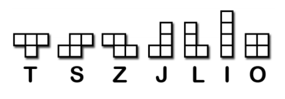

### 安装环境：

```
sudo apt-get install libncurses5-dev
```

### 编译运行：

```
make
```

### 基本逻辑

1. 显示方块
2. 实现方块的移动
3. 对方快旋转要进行渲染
4. 对底层已经满了的方块进行消除，并且将上层方块往下挪
5. 提示下一个方块形状（应该是随机的）



### NCURSES

NCURSES 封装了底层的终端功能，包含了一些创建窗口的函数，并且有 **Menu** 、**Panel** 和 **Form**对 CURSES 基础库的扩展，我们可以建立一个同时包含多窗口（multiple windows）、菜单（menus）、面板（panels）和表单（forms）的应用程序。窗口可以被独立管理，例如让它卷动（scrollability）或者隐藏。 菜单（Menus）可以让用户建立命令选项，从而方便执行命令。而窗体（Forms）允许用户建立一些简单的数据输入和显示的窗口。面板（Panels）是 NCURSES 窗口管理功能的扩展，可以用它覆盖或堆积窗口。

#### NCURSES例子

```cpp
#include <stdio.h>
#include <ncurses.h>

int main()
{
    // 初始化一个虚拟屏幕
    initscr();
    // 在虚拟屏幕上打印
    printw("hello, world");
    // 将虚拟屏幕写入当前显示器上
    refresh();
    // 等待输入
    getch();
    // 结束
    endwin();

    return 0;
}
```
